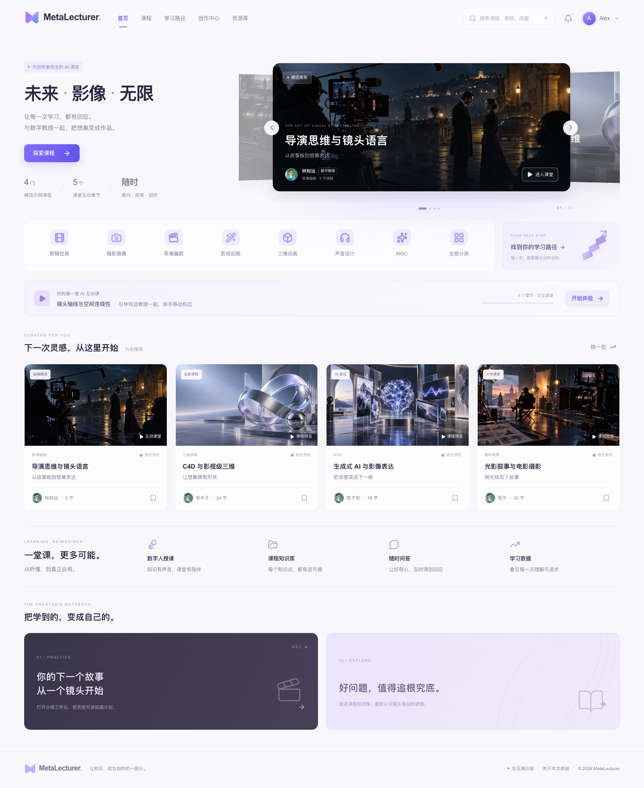
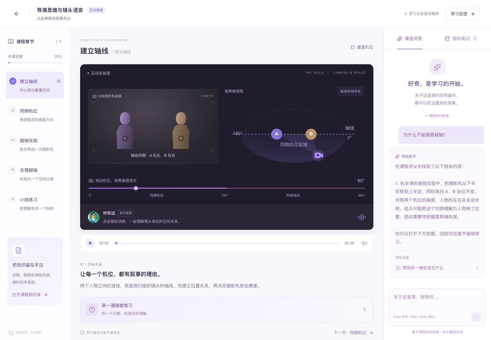

# MetaLecturer

一个面向 AI 教育产品场景的交互式课堂 Demo，使用 Next.js、React 和 TypeScript 构建。

项目围绕「课程浏览 → 互动学习 → 提问查证 → 学习反馈」提供可操作的演示流程，用于 AI 产品经理面试展示与产品原型验证。

[在线体验](https://metalecturer-demo.vercel.app) · [GitHub 仓库](https://github.com/realruian/metalecturer-demo) · [问题反馈](https://github.com/realruian/metalecturer-demo/issues) · [MIT 许可证](LICENSE)

> 当前为产品演示版本，无需登录，也不需要配置模型 API Key。课堂问答基于预置课程资料检索，未接入大语言模型。

## 界面预览

### 课程首页



### 互动课堂



## 主要功能

| 模块 | 功能 |
| --- | --- |
| 课程浏览 | 精选课程轮播、分类筛选、搜索、课程详情与收藏 |
| 互动课堂 | 中文语音讲解、五个课程章节、播放控制、机位交互实验与随堂练习 |
| 课程问答 | 检索课程资料、展示回答依据、点击引用跳转对应章节 |
| 课程知识库 | 搜索讲义与知识片段、查看资料详情、下载 Markdown 讲义 |
| 学习反馈 | 记录听课、提问、练习和笔记，支持 CSV / JSON 导出 |
| 学习路径 | 根据实际体验记录展示学习步骤完成情况 |
| 分镜工作台 | 编辑与排序镜头、保存本地草稿、导出 Markdown 分镜稿 |
| 配套页面 | 示例行业资讯、创作社区及购物车选课演示 |

## 快速体验

打开 [在线 Demo](https://metalecturer-demo.vercel.app)，按照以下流程体验：

1. 点击首页「导演思维与镜头语言」课程的「试看」，进入课堂。
2. 播放讲解，切换章节，调整摄影机位置，观察越轴前后的画面变化。
3. 提问「为什么不能随意越轴？」，查看回答与课程依据。
4. 点击引用返回对应章节，或进入知识库查阅讲义。
5. 完成练习、保存笔记，再查看学习数据与学习路径。

完整流程约需 3 分钟。也可以进入「创作中心」，编辑并导出一份分镜稿。

## 技术栈

- **应用框架**：Next.js 16、React 19
- **开发语言**：TypeScript
- **界面样式**：Tailwind CSS 4、页面独立 CSS
- **基础组件**：Radix UI、自定义 Button / Dialog
- **图标**：Lucide
- **服务端接口**：Next.js Route Handlers
- **本地存储**：浏览器 localStorage
- **部署平台**：Vercel

依赖的具体版本以 `package-lock.json` 为准。

## 本地运行

### 环境要求

- Node.js 22
- npm
- Git

当前版本不依赖数据库、模型 API Key 或其他付费服务，无需配置环境变量。

### 安装与启动

```bash
git clone https://github.com/realruian/metalecturer-demo.git
cd metalecturer-demo

npm ci
npm run dev
```

浏览器访问：

```text
http://localhost:3000
```

课堂音频需要点击播放按钮后启动。

### 检查与构建

```bash
# TypeScript 类型检查
npm run typecheck

# 课程检索、输入校验及引用测试
npm test

# 生产构建
npm run build

# 启动生产服务
npm start
```

## 项目结构

```text
app/
  page.tsx              应用入口
  globals.css           全局样式
  api/chat/route.ts      课程资料检索接口
components/
  platform.tsx          页面导航与课程目录
  home.tsx              课程首页
  classroom.tsx         互动课堂
  knowledge.tsx         课程知识库
  analytics.tsx         学习反馈
  learning-path.tsx     学习路径
  studio.tsx            分镜工作台
  discovery.tsx         资讯与创作社区
  reference-art.tsx     SVG 图标与装饰
  ui/                   共享基础组件
lib/
  courses.ts            示例课程数据
  knowledge.ts          讲义、检索逻辑与输入校验
  learning.ts           学习记录管理
public/
  assets/               图片与课程封面
  media/                预生成讲解音频
tests/
  knowledge.test.ts     检索与接口测试
```

## 部署

当前 GitHub 仓库已连接 Vercel，生产分支为 `main`。

向 `main` 推送提交后，Vercel 会自动构建；构建成功后更新[正式站点](https://metalecturer-demo.vercel.app)。

部署配置：

| 配置项 | 值 |
| --- | --- |
| 项目根目录 | 仓库根目录 |
| 框架 | Next.js |
| 安装命令 | `npm ci` |
| 构建命令 | `npm run build` |
| 输出目录 | 框架默认值 |
| 环境变量 | 当前版本无需配置 |

仓库中的 `vercel.json` 已指定 Next.js 框架。项目包含服务端问答接口，部署时需要保留 Next.js 服务端能力。

## 实现范围与限制

- **课程问答**：使用关键词与同义词检索预置讲义，返回资料片段及章节引用；未实现大模型生成或向量检索。
- **数字教授**：采用示例形象与预生成中文语音，未实现实时数字人视频或唇形同步。
- **课程内容**：完整互动课堂聚焦一门五章节微课，其他课程用于目录和详情展示。
- **学习记录**：保存在当前浏览器的 localStorage 中，不跨设备同步；清除浏览器数据会影响记录。
- **示例数据**：平台规模、课程价格、班级统计、资讯和社区作品用于界面演示，不代表真实运营数据。
- **购物车**：仅保存选课清单，不创建订单或发起支付。
- **分镜工作台**：支持编辑与导出，不生成 AI 图片或视频。

## 问题反馈

欢迎通过 [GitHub Issues](https://github.com/realruian/metalecturer-demo/issues) 提交问题或建议。

报告问题时，请尽量提供：

- 出现问题的页面和操作步骤；
- 预期结果与实际结果；
- 浏览器、设备及相关截图。

## 许可证与素材说明

本项目的原创代码及配套文档采用 [MIT 许可证](LICENSE) 开源。许可证范围与素材例外详见 [THIRD_PARTY_NOTICES.md](THIRD_PARTY_NOTICES.md#许可证适用范围)。

`public/assets/`、`public/media/` 和 `docs/screenshots/` 中的图片、图标文件、音频及截图不纳入本项目的 MIT 授权；第三方依赖保留各自的许可证，产品名称和标识不因代码开源而获得额外授权。

原始 HTML 原型仅作为本地参考文件，不随本仓库发布。部分图片提取自原型，其原始来源与使用权限尚未另行核实；补充封面和虚构讲师头像由 imagegen 生成，分类图标与装饰使用 SVG 实现。素材来源详见上述说明文件。
